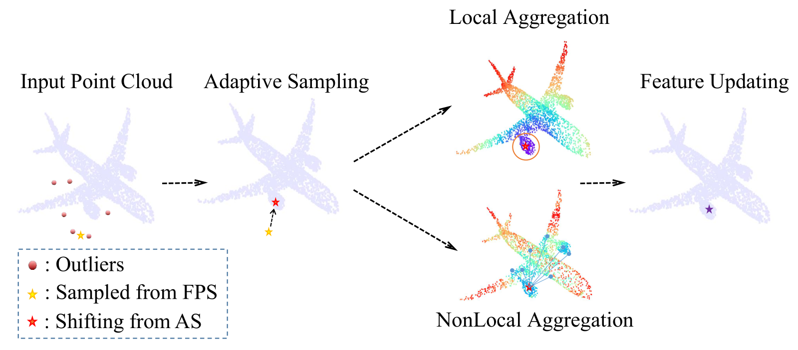

# PointASNL

This repository is for **PointASNL** introduced in the following paper

Xu Yan, Chaoda Zheng, [Zhen Li*](https://mypage.cuhk.edu.cn/academics/lizhen/), Sheng Wang and Shuguang Cui, "PointASNL: Robust Point Clouds Processing using Nonlocal Neural Networks with Adaptive Sampling", CVPR 2020 [[arxiv]](https://arxiv.org/pdf/2003.00492.pdf).



If you find our work useful in your research, please consider citing:
```
@InProceedings{yan2020pointasnl,
  title={PointASNL: Robust Point Clouds Processing using Nonlocal Neural Networks with Adaptive Sampling},
  author={Yan, Xu and Zheng, Chaoda and Li, Zhen and Wang, Sheng and Cui, Shuguang},
  journal={Proceedings of the IEEE Conference on Computer Vision and Pattern Recognition},
  year={2020}
}
```

## Getting Started

### (1) Set up
Clone the repository:
```
git clone https://github.com/yanx27/PointASNL.git
```

Installation instructions for Ubuntu 16.04 (available at **CUDA10**):
     
* Make sure <a href="https://docs.nvidia.com/cuda/cuda-installation-guide-linux/index.html">CUDA</a>  and <a href="https://docs.nvidia.com/deeplearning/sdk/cudnn-install/index.html">cuDNN</a> are installed. Only this configurations has been tested: 
     - Python 3.6.9, TensorFlow 1.13.0, CUDA 10.1


* Follow <a href="https://www.tensorflow.org/install/pip">Tensorflow installation procedure</a>.
     
     
* Compile the customized Tensorflow operators by `sh complile_op.sh`. 
N.B. If you installed Tensorflow in a virtual environment, it needs to be activated when running these scripts


### (2) ModelNet40 Classification
Aligned ModelNet40 dataset can be found [here](https://shapenet.cs.stanford.edu/media/modelnet40_normal_resampled.zip). Since the randomness of data augmentation, the result of this code maybe slightly different from the result in paper, but it should be around 93%. 
#### Data without Noise
It will cost relatively long time in first epoch for cache construction.
```
# Training 
$ python train.py --data [MODELNET40 PATH] --exp_dir PointASNL_without_noise

# Evaluation 
$ python test.py --data [MODELNET40 PATH] --model_path log/PointASNL_without_noise/best_model.ckpt
```
#### Data with Noise
Model with AS module is extremely robust for noisy data. You can use adaptive sampling by setting `--AS` . 
```
# Training 
$ python train.py --data [MODELNET40 PATH] --exp_dir PointASNL_with_noise --AS

# Evaluation on noisy data 
$ python test.py --data [MODELNET40 PATH]  --model_path log/PointASNL_with_noise/best_model.ckpt --AS --noise
```

### (3) ScanNet Segmentation
We provide two options for training on ScanNet dataset (with or without pre/post processing). 
With grid sampling processing, more input points and deeper network structure, our PointASNL can achieve **66.6%** on ScanNet [benchmark](http://kaldir.vc.in.tum.de/scannet_benchmark/).
#### Data Preparation
Official ScanNet dataset can be downloaded [here](http://www.scan-net.org/). 
If you choose training without grid sampling, you need firstly run `ScanNet/prepare_scannet.py`, otherwise you can skip to training step.
#### Data without Processing
This method converges relatively slower, and will achieve result around 63%.
```
# Training 
$ cd ScanNet/
$ python train_scannet.py --data [SCANNET PATH] --log_dir PointASNL

# Evaluation 
$ cd ScanNet/
$ python test_scannet.py --data [SCANNET PATH]  --model_path log/PointASNL/latest_model.ckpt 
```
#### Data with Grid Sampling
We highly recommend training with this method, although it takes a long time to process the raw data, it can achieve results around 66% and will be faster to converge. Grid sampling pre-processing will be automatically conducted before training.
```
# Training 
$ cd ScanNet/
$ python train_scannet_grid.py --data [SCANNET PATH] --log_dir PointASNL_grid --num_point 10240 --model pointasnl_sem_seg_res --in_radius 2

# Evaluation 
$ cd ScanNet/
$ python test_scannet_grid.py --data [SCANNET PATH]  --model_path log/PointASNL_grid/latest_model.ckpt 
```
### (4) SemanticKITTI Segmentation
* SemanticKITTI dataset can be found [here](http://semantic-kitti.org/dataset.html#download). Download the files related to semantic segmentation and extract everything into the same folder. 
* We add codes with grid sampling processing, which can achieve better result of around **52%** (using `--prepare_data` just in the first running).
* Please using official [semantic_kitti_api](https://github.com/PRBonn/semantic-kitti-api) for evaluation.
```
# Training 
$ cd SemanticKITTI/
$ python train_semantic_kitti.py --data [SemanticKITTI PATH] --log_dir PointASNL --with_remission
# or
$ python train_semantic_kitti_grid.py --data [SemanticKITTI PATH] --log_dir PointASNL_grid --prepare_data 

# Evaluation 
$ cd SemanticKITTI/
$ python test_semantic_kitti.py --data [SemanticKITTI PATH]  --model_path log/PointASNL/latest_model.ckpt  --with_remission
# or
$ python test_semantic_kitti_grid.py --data [SemanticKITTI PATH] --model_path log/PointASNL_grid/best_model.ckpt --test_area [e.g., 08]

```


## Acknowledgement
* The original code is borrowed from [PointNet++](https://github.com/charlesq34/pointnet2) and [PointConv](https://github.com/DylanWusee/pointconv).
* The code with grid sampling is borrowed from [KPConv](https://github.com/HuguesTHOMAS/KPConv) and [RandLA-Net](https://github.com/QingyongHu/RandLA-Net). 
* The kd-tree tool is from [nanoflann](https://github.com/jlblancoc/nanoflann).
## License
This repository is released under MIT License (see LICENSE file for details).
